# goethereumclient
## Proposal Blockchain System
Nodejs geth client, uses web3 for making several requests inside the blockchain private network.

## Start geth node

Run command for genesis json load before
```
geth --datadir ./myDataDir --networkid 1114 init ./myGenesis.json
```
We can copy inside ./myDataDir/keystore our own keystore file before running bellow command.
```
nohup geth --datadir ./myDataDir --networkid 1114 --ws --wsorigins="*" --wsapi "db,eth,net,ssh,miner,web3,personal,admin" --rpc --rpcapi "web3,eth,personal,miner,net,txpool" --rpccorsdomain "*" --ipcdisable &
```
### Blockchain Rest features

We don't expose the network for the outside, cors are not used in this demo, so we just expose a rest feature for interacting using web3 api.
```
/getenv returns websocket url, can be remote.
/coinbase returns the blockchain coinbase, just for testing purposes.
/getbalance returns an address balance.
/unlockAccount unlock an account based on its address and passphrase, automatically eth locks every acount after some 600 seconds for security feature.
/createAccount create a new account using only its passphrase.
```

## Steps for running

```
Set .env file to ENV_SERVER=localhost:43 or any url with https available.
Set .env file to ENV_CERTPASS=123456 or your certification passphrase.
Set .env file to ENV_GETHLOG for geth log full file path.
```

Import your certificate in the browser, websockets won't workts without a https transport!

Install pm2 feature for monitoring and starting node instances as bellow
```
npm install pm2 -g
```

```
pm2 start node websocket.js
pm2 start npm start --
```

## Next steps

Basic user authentication using address and his passphrase in the blockchain.
Allow websockets monitor transactions flow inside the network and output on the screen.
Update user balance and transactions.

## Development environment

### Webstorm screenshots
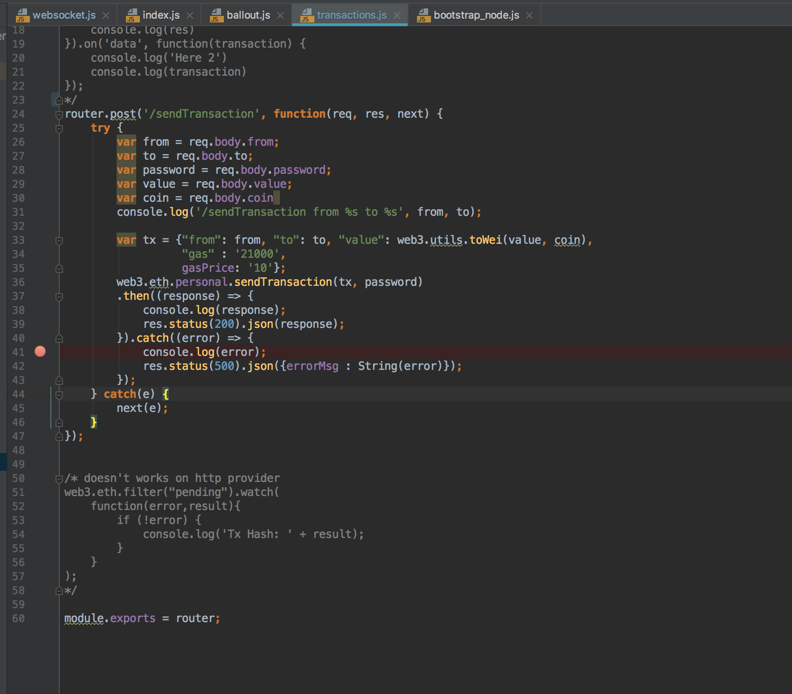
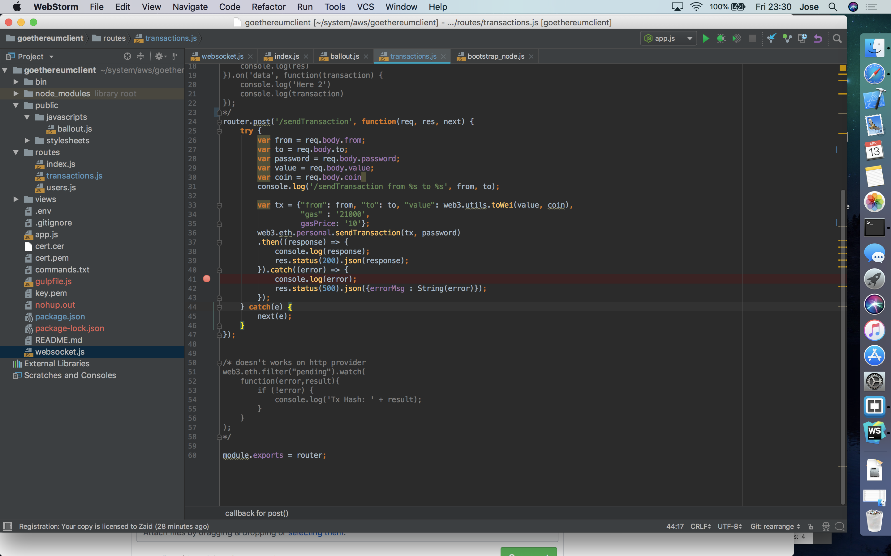
#### Running
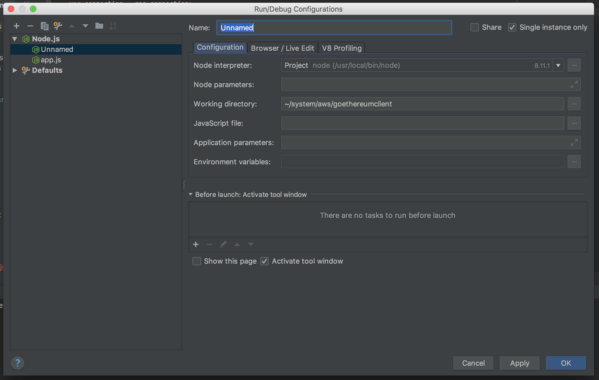

### VSCode screenshots and running

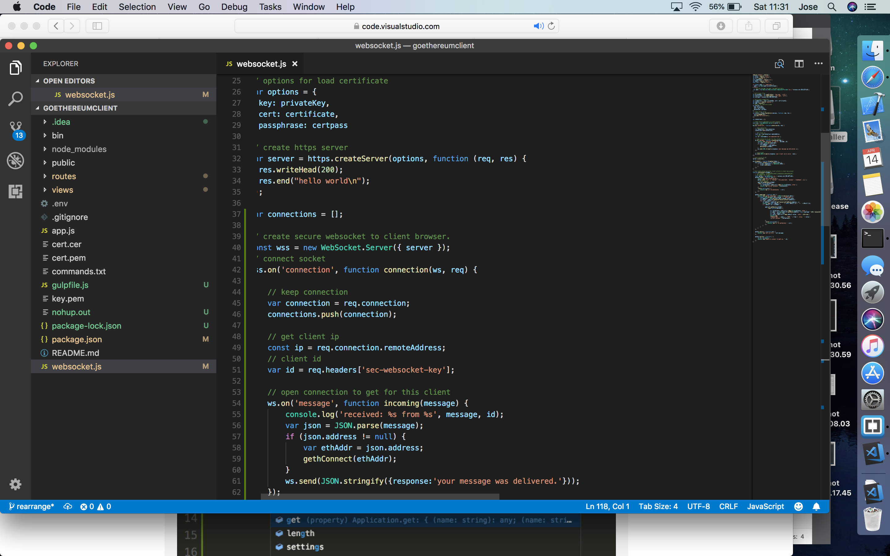
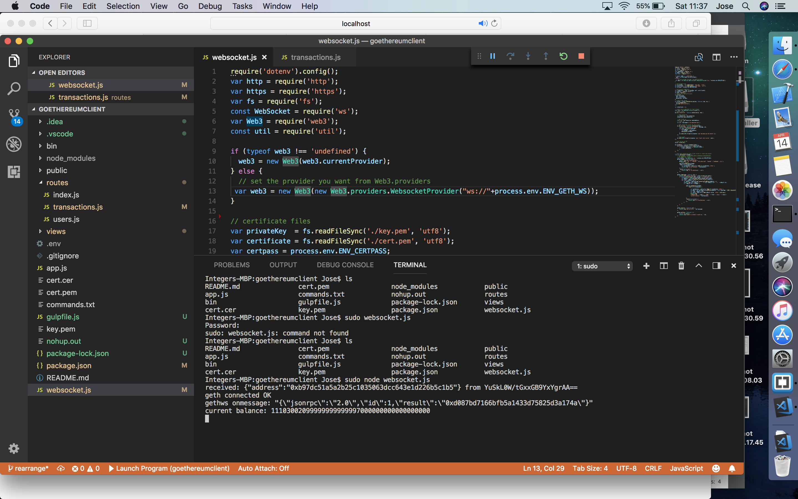
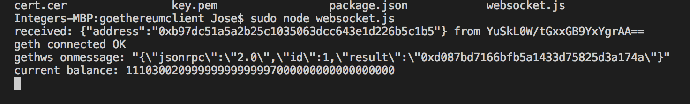
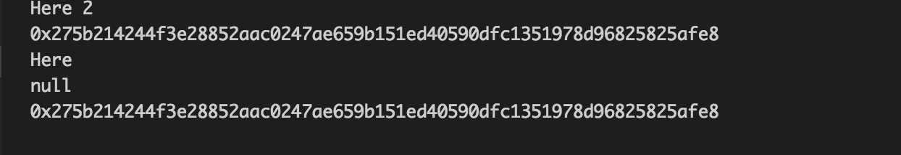
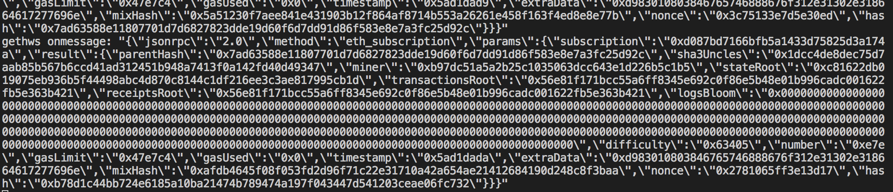

### Geth attach
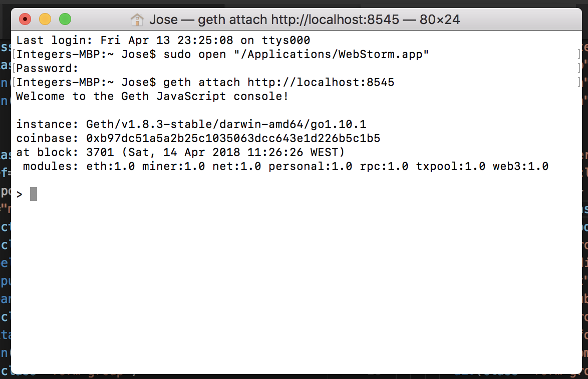
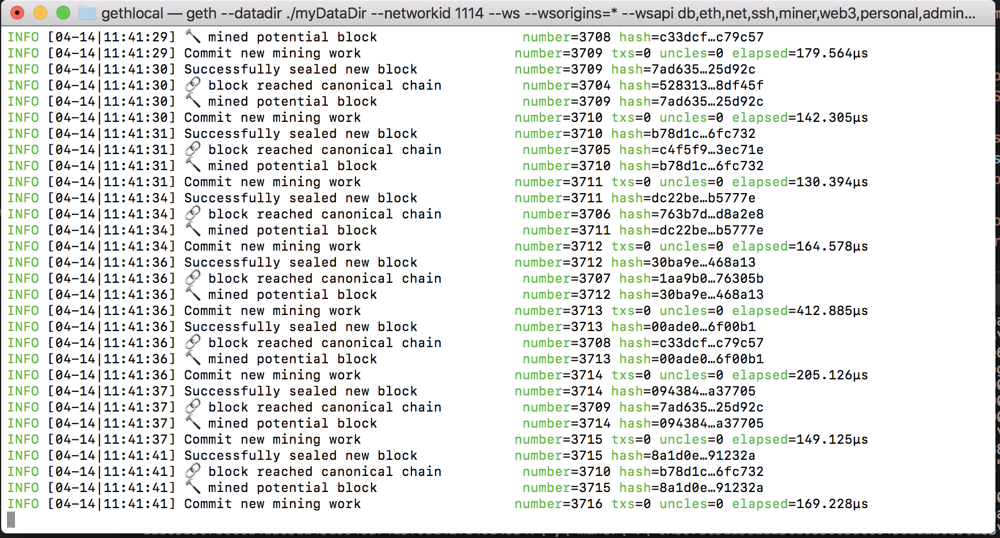
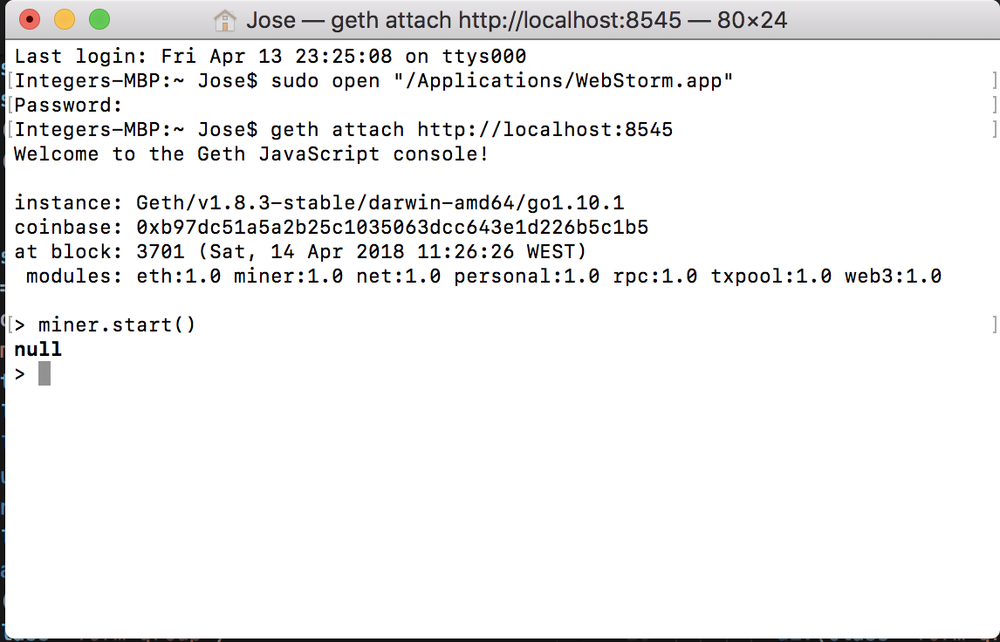
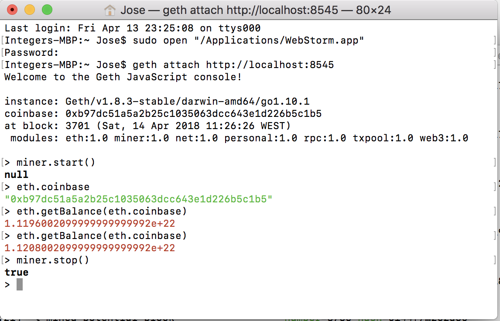
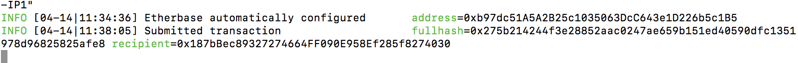

